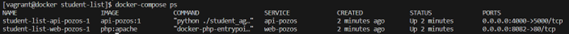

# Correction

## Technologies used

- Windows System
- VirtualBox
- Vagrant: To launch our virtual machine with CentOS 7. Make sure to install it.
- Docker
- GitHub

## Practical Work

1. Create a folder named "Lab Docker Student List" on your machine.

2. Download the two files "Vagrantfile" and "install_docker" from the project to launch the virtual machine locally via this link: https://github.com/diranetafen/cursus-devops/tree/master/vagrant/docker

3. Navigate to the folder and open your terminal, then execute the following command to create your Docker machine in VirtualBox and connect to it:
```bash 
vagrant up --provision
vagrant ssh
```
> **Note:** Password: vagrant

4. Install Git:
```bash
sudo yum install git
```
> **Note:** If you encounter update issues with Yum, please delete the epl directories using the following commands:
```bash
cd /etc/yum.repos.d/
sudo rm -f epel*
```

5. Clone the application and navigate to the /student-list/simple_api directory:
```bash
sudo git clone https://github.com/ezechielthione/student-list.git
cd student-list/simple_api
```

6. Modify the Dockerfile to build the image:
```bash
sudo vi Dockerfile
```
```bash
FROM python:2.7-buster
LABEL maintainer="EZECHIEL THIONE"
ADD student_age.py /
RUN apt update -y && apt install python-dev python3-dev libsasl2-dev python-dev libldap2-dev libssl-dev -y
RUN pip install flask==1.1.2 flask_httpauth==4.1.0 flask_simpleldap python-dotenv==0.14.0
VOLUME ["/data"]
EXPOSE 5000
CMD [ "python", "./student_age.py" ]
```

### English Translation

7. Build the image
```sh
sudo docker build -t api-pozos:1 .
```
Note: If Docker does not start, please reinstall and restart it using the following commands:
```sh
sudo yum install docker
sudo service docker start
```

8. Test the image by creating a Pozos network and a container

```sh
sudo docker network create pozos
sudo docker run -d --network pozos --name test-api-pozos -v ${PWD}/student_age.json:/data/student_age.json -p 4000:5000 api-pozos:1
```
In summary, this Docker command runs a container named "test-api-pozos", connects it to the "pozos" network, mounts a volume to share the file `student_age.json`, maps port 4000 of the host to port 5000 of the container, and uses the image "api-pozos:1".

>**Note:** Useful
In case of restarting Vagrant, navigate to the directory:
```sh
cd /etc/yum.repos.d/student-list/simple_api
```
to find the project.

9. Execute the curl command to ensure the API responds correctly

```sh
curl -u toto:python -X GET http://<host IP>:<API exposed port>/pozos/api/v1.0/get_student_ages
```
Host IP: Local IP
API exposed port: 4000
```sh
curl -u toto:python -X GET http://127.0.0.1:4000/pozos/api/v1.0/get_student_ages
```


## Infrastucture As Code

Set up a Docker Compose to automate our infrastructure. Navigate to:

```bash
cd /etc/yum.repos.d/student-list
```
Edit the Docker Compose YAML file with the following code:
```bash
sudo vi Docker-compose.yml
```
Delete the test-api-pozos container
```sh
sudo docker ps -a 
sudo docker rm -f <container_id>
```
Delete the previously created network
```sh
sudo docker network rm pozos
```
Install Docker Compose
```sh
sudo curl -SL https://github.com/docker/compose/releases/download/v2.20.0/docker-compose-linux-x86_64 -o /usr/local/bin/docker-compose
```
Make it executable
```sh
sudo chmod +x /usr/local/bin/docker-compose
```
Verify the installation and version
```sh
docker-compose -v
```
Ensure the /var/run/docker.sock file has the correct permissions.
```sh
sudo chmod 666 /var/run/docker.sock
```
Restart Docker
```sh
sudo service docker restart
```

11. Launch Docker Compose in the background.
```sh
docker-compose up -d

```
12. Verify the images
```sh
docker-compose ps
```



13. Find my IP for running the UI
```sh
ip a
```
Test from the UI
```
192.168.56.5:8082
```


14. Fix the error on the "list student" tab in the UI

Navigate to the website directory and open the index file for modification at the concerned line
```sh
sudo vi website/index.php
```
Edit line 29 with the internal port number of my API (5000) and the image name:
```php
$url = 'http://student-list-api-pozos-1:5000/pozos/api/v1.0/get_student_ages';
```


>**Note:** Ensure that both containers have started. Use the command:
```sh
sudo docker start <container_id>
```
or
```sh
sudo docker-compose up -d
```

# Docker Registry Prive

Application to store our images in our local infrastructure on a server

15. Deploy a registry on port 5000 so that our images can access it
```sh
sudo docker run -d -p 5000:5000 --name registry-pozos --network student-list_api-pozos registry:2
```
This command launches a Docker container based on Docker registry (version 2), names it "registry-pozos", connects it to the Docker network "student-list_api-pozos", and maps port 5000 of the host to port 5000 of the container. This is useful for hosting a local Docker registry accessible on port 5000 of your machine.


16. Verify the registry
```sh
sudo docker ps -a
```


17. Rename my image so it can be pushed to the local registry
```sh
sudo docker images
sudo docker image tag api-pozos:1 localhost:5000/api-pozos:1
sudo docker push localhost:5000/api-pozos:1
```

18. Launch the registry with a Joxit container in the same network. It is recommended to use Docker Compose because `docker run` is for a development environment. When dealing with multiple resources, Docker Compose is advised.
```sh
sudo docker run -d --network student-list_api-pozos -p 4002:80 -e REGISTRY_TITLE="POZOS REGISTRY" -e REGISTRY_URL="https://registry-pozos:5000" -e DELETE_IMAGES=true joxit/docker-registry-ui:static
```

19. Verify the image
```sh
sudo docker ps -a
```

20. Check the UI
[http://192.168.56.5:4002/](http://192.168.56.5:4002/)

>**Note:** Replace the IP with that of your machine (localhost). Verify it with `ip -a`.


21. Push another image to the registry
```sh
sudo docker image tag joxit/docker-registry-ui:static localhost:5000/joxit/docker-registry-ui:static
sudo docker push localhost:5000/joxit/docker-registry-ui:static
```

22. Check the UI
[http://192.168.56.5:4002/](http://192.168.56.5:4002/)